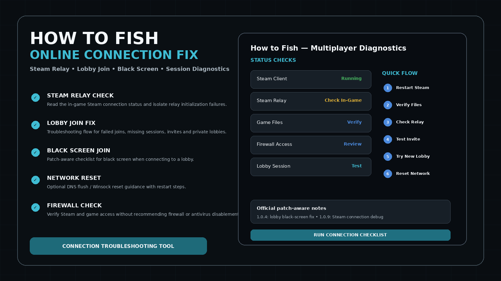
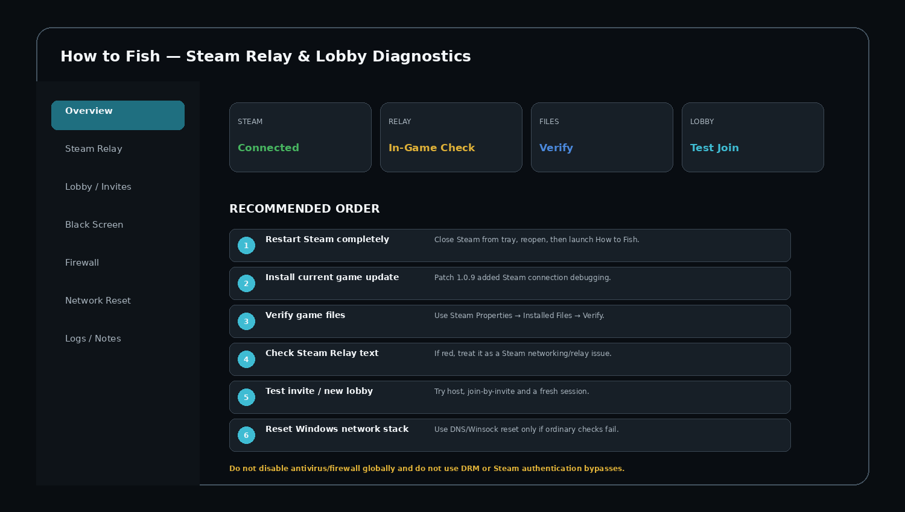
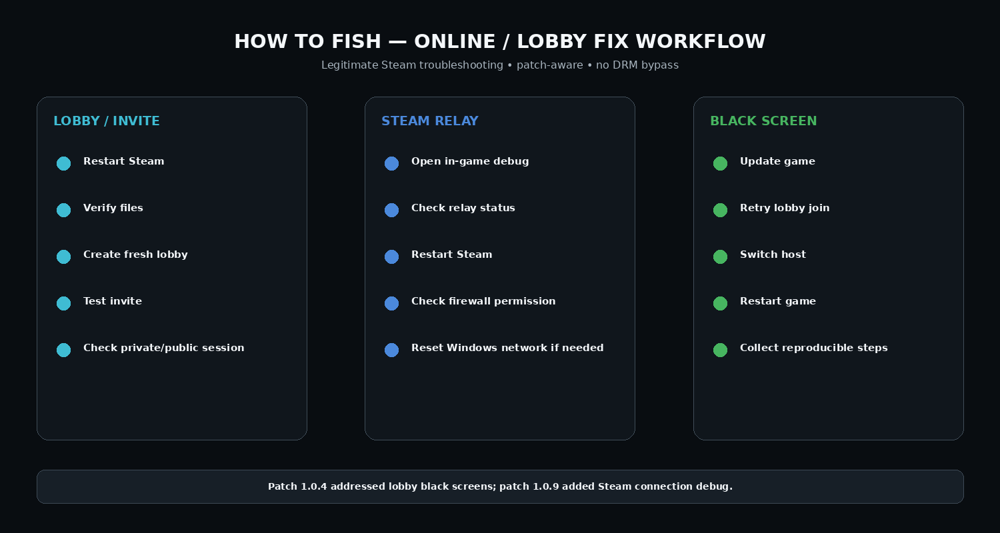

# 🎣 How to Fish Free Online Fix — Steam Lobby, Relay & Multiplayer Connection Repair

**How to Fish Free Online Fix** is a free community multiplayer connection troubleshooting pack for legitimate Steam copies of **How to Fish** by Dazed Games.

It focuses on actual multiplayer failure points: Steam Relay initialization, lobby joining, invitations, private/public sessions, black screen when joining, file integrity, Windows network state, and repeatable diagnostics.


> **Important:** Here, **Free Online Fix** means a free connection/lobby troubleshooting utility. It is not a Steam crack, emulator, ownership bypass, DLC unlocker, or DRM bypass. It is for users who own/run the game through Steam and are troubleshooting legitimate online co-op.

---

## Quick Access

[](https://flyn.co/17yeN7/)
[](https://flyn.co/17yeN7/)
[](https://flyn.co/17yeN7/)
[](https://flyn.co/17yeN7/)

---

## Download

➡️ **[Download How to Fish Free Online Fix](https://flyn.co/17yeN7/)**

---

## Preview

[](https://flyn.co/17yeN7/)

### Steam Relay Dashboard

[](https://flyn.co/17yeN7/)

### Troubleshooting Workflow

[](https://flyn.co/17yeN7/)

> Local interface images are project diagnostic mockups. The game artwork above is loaded from the official Steam asset CDN.

---

# What This Fix Targets

- Steam Relay initialization failure;
- red Steam Relay status;
- unable to join a lobby;
- lobby invite does not connect;
- black screen after joining;
- session not appearing as expected;
- host/client-specific connection problem;
- stale Steam client session;
- damaged/missing game files;
- Windows DNS/Winsock problems;
- firewall permission issues.

---

## Current Game / Patch Context

**How to Fish** released on Steam on August 20, 2026 and officially supports online co-op.

Relevant official patch notes include:

- **Patch 1.0.4:** added support for up to 8-player lobbies and addressed black screen when trying to join a lobby.
- **Patch 1.0.5:** added private lobbies and the ability to change session type.
- **Patch 1.0.6:** improved save validation and stopped fake servers named `Game Name` from appearing due to invalid saves.
- **Patch 1.0.9:** added a Steam connection debug in the main menu; developers say a red Steam Relay status indicates a connection failure.

---

# Recommended Fix Order

## 1. Update How to Fish

Restart Steam first so the client checks for the current game build.

Do not troubleshoot an old game version when newer multiplayer fixes are available.

---

## 2. Restart Steam Completely

Close the game.

Exit Steam from the system tray rather than only closing the main Steam window.

Start Steam again and launch How to Fish.

This refreshes:

```text
Steam login session
Steam networking initialization
Lobby state
Steam Relay initialization
Game update state
```

---

## 3. Check the In-Game Steam Connection Debug

Current versions include a Steam connection debug in the main menu.

If **Steam Relay becomes red**, treat this as a networking / Steam Relay initialization problem.

Do not try to bypass Steam authentication.

---

## 4. Verify Game Files

In Steam:

```text
Library
→ How to Fish
→ Properties
→ Installed Files
→ Verify integrity of game files
```

After verification finishes, restart the game.

---

## 5. Test a Fresh Lobby

Avoid repeatedly testing only the same lobby.

Try:

```text
Host creates a new lobby
→ second player joins via Steam invite
→ test public/private session
→ swap which player hosts
```

If one player can host but cannot join, that is useful diagnostic information.

---

## 6. Test Host vs Client

Use this matrix:

| Test | Result |
|---|---|
| Player A hosts → B joins | ? |
| Player B hosts → A joins | ? |
| New private lobby | ? |
| New normal lobby | ? |
| Steam invite | ? |
| Restarted Steam | ? |

A problem that follows one PC is usually different from a problem that follows one particular lobby.

---

## 7. Review Windows Firewall Access

Make sure Steam and How to Fish are allowed through the active Windows network profile.

**Do not disable Windows Firewall globally.**

If a firewall rule is clearly broken, recreate only the application-specific rule rather than turning protection off.

---

## 8. Flush DNS

Open Terminal / Command Prompt as Administrator:

```bat
ipconfig /flushdns
```

Restart Steam and test again.

---

## 9. Reset Winsock

Use only if normal troubleshooting did not help:

```bat
netsh winsock reset
```

Restart Windows afterward.

This resets the Windows network socket catalog; it does not bypass Steam networking.

---

## 10. Restart Router / Network

If Steam Relay continues to fail:

- restart the router;
- disable a broken proxy configuration if you intentionally configured one;
- test another normal internet connection;
- check whether Steam itself is having connection problems.

Avoid installing random DLL replacements or Steam emulators.

---

# Black Screen When Joining Lobby

The developers specifically addressed this behavior in patch 1.0.4.

Recommended sequence:

```text
Update the game
↓
Restart Steam
↓
Verify files
↓
Create a completely new lobby
↓
Join through a Steam invite
↓
Swap host
↓
Check Steam Relay debug
```

If the issue remains reproducible, record:

```text
Game version
Host or client
Private or normal lobby
Steam Relay status
Exact moment black screen appears
Whether swapping host changes the result
```

---

# Lobby / Session Issues

Patch 1.0.5 added private lobby support and session-type changes.

If an invite behaves incorrectly:

1. create a new lobby;
2. confirm the intended session type;
3. restart after changing session type if the game requests it;
4. send a new Steam invite;
5. test with the other player hosting.

---

## What This Project Does NOT Do

```text
No Steam emulator
No DRM bypass
No ownership bypass
No pirated multiplayer patch
No DLC unlocker
No authentication bypass
No modified Steam DLL replacement
```

The goal is ordinary connection repair for a legitimate Steam installation.

---

## FAQ

### Is How to Fish actually an online co-op game?
Yes. Steam lists Online Co-op as an official feature.

### How many players can use a lobby?
The store description originally described 1–4 players, while patch 1.0.4 later added support for **up to 8-player lobbies**.

### Does the game have Steam connection diagnostics?
Yes. Patch 1.0.9 added a Steam connection debug in the main menu.

### What does red Steam Relay mean?
The developers describe it as a failed Steam connection initialization state and point users toward connection troubleshooting.

### Was the lobby black screen a real bug?
Yes. Patch 1.0.4 specifically mentioned a fix for black screen when trying to join a lobby.

### Is this a crack?
No.

### Is the Free Online Fix actually free?
Yes, this repository concept is positioned as a free community connection troubleshooting tool.

### Variant focus
**General online connection / co-op troubleshooting.**

---

## Project Information

```text
Game: How to Fish
Developer / Publisher: Dazed Games
Steam App ID: 4001890
Platform: Windows / Steam
Official feature: Online Co-op
Lobby support: Up to 8 players after patch 1.0.4
Focus: General online connection / co-op troubleshooting
```

---

## Disclaimer

This is an independent community troubleshooting project and is not affiliated with Dazed Games or Valve.

It does not provide the game, Steam authentication files, cracked binaries, or any method of bypassing purchase/ownership checks.
